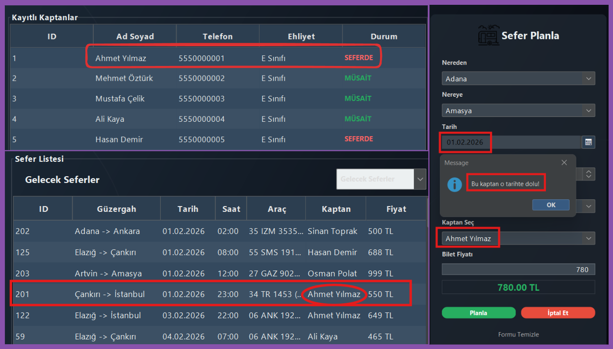
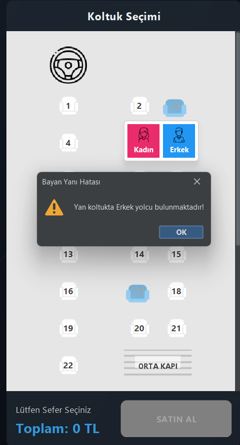
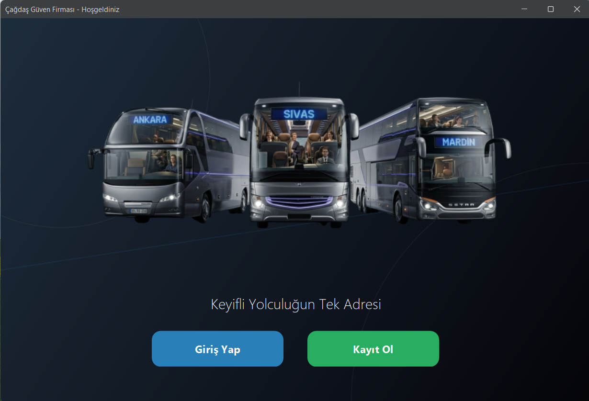
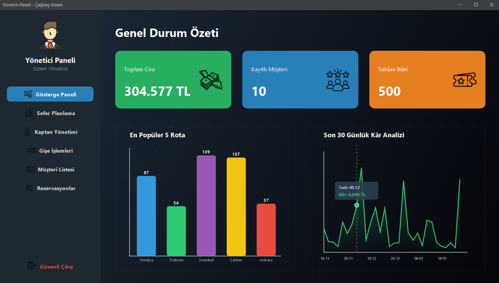
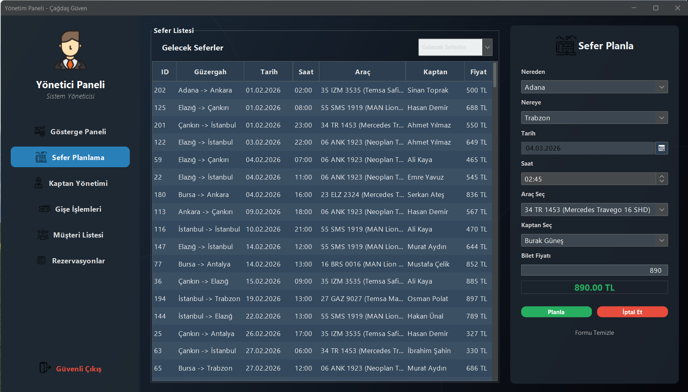
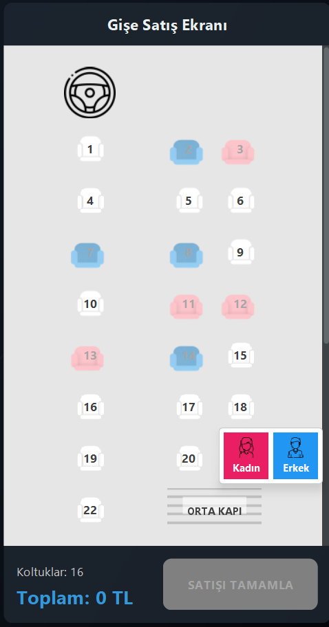
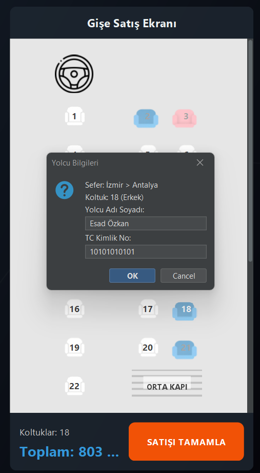
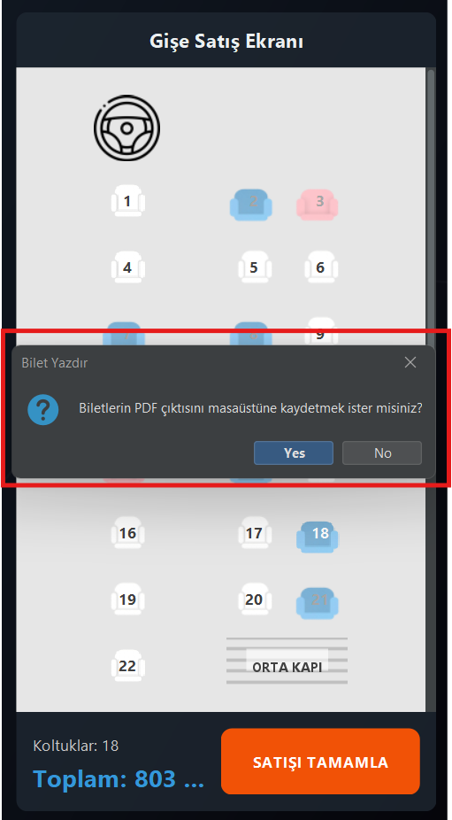
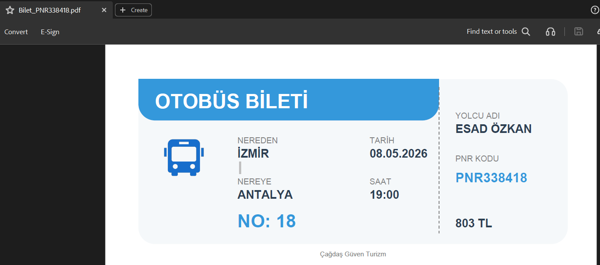
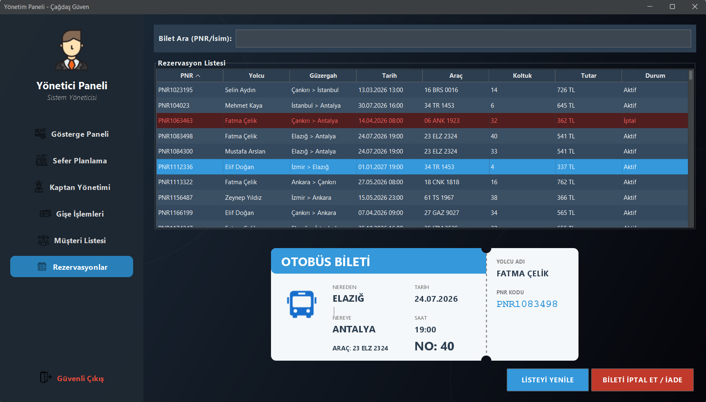

<div align="center">
    <h1>T.C. HARRAN ÜNİVERSİTESİ</h1>
    <h2>MÜHENDİSLİK FAKÜLTESİ</h2>
    <h3>BİLGİSAYAR MÜHENDİSLİĞİ BÖLÜMÜ</h3>
    <br>
    <h4>JAVA İLE PROGRAMLAMA DERSİ YAZILIM PROJE RAPORU</h4>
    <br>
    <h2>PROJE ADI: OTOBÜS OTOMASYONU<br>(ÇAĞDAŞ GÜVEN TURİZM)</h2>
    <br><br>
    <p>
        <b>Hazırlayan:</b> Mahmut Esat Ali ÖZKAN [2*0*0*0*1]<br>
        <b>Teslim Tarihi:</b> 29.12.2025
    </p>
</div>

<br>
<hr>
🛠️ PROJE KÜNYESİ

| Alan | Detaylar |
| :--- | :--- |
| 👨‍💻 **Geliştirici** | Mahmut Esat Ali ÖZKAN |
| 💻 **Geliştirme Ortamı** | JetBrains IntelliJ IDEA, MySQL Workbench |
| ☕ **Programlama Dili** | Java (JDK 17 LTS) |
| ☁️ **Veritabanı** | MySQL (Cloud - FreeSQLDatabase) |
| 📚 **Kütüphaneler** | Java Swing, AWT, **FlatLaf** (UI Teması), **iText 2.1.7** (PDF), LGoodDatePicker, JDBC |
| ⚙️ **Donanım Gereksinimi** | Intel Core i5/i7 İşlemci, 16GB RAM, SSD Depolama |
| 🖥️ **Yazılım Gereksinimi** | Java Runtime Environment (JRE 18+), Windows 10/11 |
| 📏 **Kod Satır Sayısı** | 5000+ Satır |

---

## 1. PROBLEMİN TANIMLANMASI VE PROGRAMIN AMACI

Günümüzde şehirlerarası yolcu taşımacılığı yapan firmaların en büyük operasyonel sorunu; bilet satışlarının, sefer planlamalarının ve personel (kaptan) yönetiminin **manuel defterler veya entegre olmayan eski sistemlerle** yürütülmesidir. Bu durum veri kayıplarına, aynı koltuğun birden fazla kişiye satılmasına (çakışma), raporlama eksikliklerine ve müşteri memnuniyetsizliğine yol açmaktadır.

**Bu projenin temel amacı;** "Çağdaş Güven Turizm" firması örneği üzerinden, bir otobüs firmasının tüm operasyonel süreçlerini dijitalleştirmek, verileri **ilişkisel bir veritabanı (RDBMS)** üzerinde güvenle saklamak ve hem yönetici (Admin) hem de son kullanıcı (Müşteri) için **kullanıcı dostu (User-Friendly)** bir masaüstü yazılımı geliştirmektir. Proje, manuel hataları sıfıra indirmeyi ve yönetimsel kararlar için anlık veri akışı sağlamayı hedeflemektedir.

---

## 2. TEKNİK ALTYAPI VE VERİTABANI MİMARİSİ

### 2.1. Bulut Tabanlı Veritabanı (Cloud Architecture)
Sistem, klasik yerel (localhost) depolama yerine, verilerin her yerden erişilebilir olmasını sağlayan **Bulut (Cloud) MySQL** mimarisi üzerine kurulmuştur. Bu sayede uygulamanın kurulu olduğu herhangi bir bilgisayardan yapılan işlem, saniyeler içinde tüm sisteme yansımaktadır.

### 2.2. Veri İlişkileri

Proje, **İlişkisel Veritabanı Yönetim Sistemi (RDBMS)** prensiplerine uygun olarak tasarlanmıştır.

* **Tablolar:** Seferler, Kaptanlar, Araçlar, Biletler ve Kullanıcılar tabloları **Primary Key** ve **Foreign Key** yapılarıyla birbirine bağlanmıştır.
* **Veri Tutarlılığı:** Bu yapı sayesinde, bir sefer silindiğinde o sefere ait biletlerin tutarlılığı korunur veya bir kaptan işten ayrıldığında geçmiş sefer kayıtları bozulmaz.

<div align="center">
    
    <p><i>Şekil 1: Veritabanı İlişkisel Şeması (ER Diyagramı)</i></p>
</div>

---

## 3. ALGORİTMİK YAPI VE KRİTİK KOD BLOKLARI

### 3.1. Kaptan Müsaitlik ve Çakışma Kontrolü Algoritması

Projenin en kritik algoritmalarından biri **Kaptan Müsaitlik Kontrolü**'dür. Başlangıçta kaptan tablosunda sabit bir "Durum" sütunu tutulması planlanmış, ancak bu yöntemin sürdürülebilir olmadığı (kaptan seferden dönse bile meşgul görünmesi) tespit edilmiştir.

Bunun yerine **Tarih Bazlı Dinamik Sorgu Algoritması** geliştirilmiştir:

1. Admin bir kaptanı yeni bir sefere atamak istediğinde sistem tetiklenir.
2. Seçilen kaptanın ID'si ve Sefer Tarihi parametre olarak alınır.
3. Veritabanına şu SQL sorgusu gönderilir:
   ```sql
   SELECT COUNT(*) FROM seferler WHERE kaptan_id = ? AND tarih = ?
<div align="center">
    
    <p><i>Şekil 2: Kaptan Müsaitlik Kontrolü ve Çakışma Önleme Sistemi</i></p>
</div>

### 3.2. Cinsiyet Bazlı Koltuk Seçim Algoritması (2+1 Düzeni)

Otobüs sektöründeki **"Bayan Yanı"** kuralı yazılımsal olarak simüle edilmiştir. Sistem, seçilen koltuğun yanındaki koltuğun dolu olup olmadığını kontrol eder. Eğer doluysa, yan koltuktaki yolcunun cinsiyetini veritabanından çeker. Cinsiyet uyuşmazlığı varsa (Örn: Erkek yanına Kadın), sistem satışı otomatik olarak engeller ve kullanıcıyı uyarır.

<div align="center">
    
    <p><i>Şekil 3: Cinsiyet Uyumluluk (Bayan Yanı) Denetim Sistemi</i></p>
</div>

---

## 4. MODÜLLER VE EKRAN GÖRÜNTÜLERİ

### 4.1. Modern Giriş Ekranı
Kullanıcı deneyimi (UX) ön planda tutularak sade ve kurumsal bir tasarım tercih edilmiştir. **FlatLaf** kütüphanesi ile modern bir görünüm elde edilmiştir.

<div align="center">
    
</div>

### 4.2. Yönetici Paneli (Dashboard)
Firmanın anlık durumu görselleştirilmiştir:

* **Özet Kartları**: Toplam ciro, kayıtlı müşteri sayısı ve satılan bilet adedi anlık olarak veritabanından çekilir.
* **Grafiksel Analiz**: "En Popüler 5 Rota" ve "Son 30 Günlük Kâr Analizi" gibi veriler, Java'nın **Graphics2D** kütüphanesi kullanılarak dinamik grafiklere dönüştürülmüştür.

<div align="center">
    
</div>

### 4.3. Sefer Planlama Modülü
Yöneticiler; tarih, saat, güzergah ve kaptan seçimi yaparak yeni seferler oluşturabilir. Tarih seçimi için **LGoodDatePicker** bileşeni entegre edilmiştir.

<div align="center">
    
</div>

### 4.4. Bilet Satış ve Koltuk Seçimi
Projenin en işlevsel modülüdür. 2+1 otobüs şeması görselleştirilmiştir. Kadın yolcular için **Pembe**, Erkek yolcular için **Mavi** koltuk ikonları kullanılır.

<div align="center">
  <table>
    <tr>
      <td></td>
      <td></td>
    </tr>
  </table>
  <p><i>Şekil 4: İnteraktif Koltuk Seçimi ve Yolcu Bilgi Girişi</i></p>
</div>

### 4.5. PDF Bilet Oluşturma ve Raporlama
Satış işlemi onaylandığında sistem kullanıcıya biletin PDF çıktısını almak isteyip istemediğini sorar. Onay verildiği takdirde **iText** kütüphanesi devreye girer ve yolcuya özel, PNR kodlu bir PDF bilet oluşturarak masaüstüne kaydeder.

<div align="center">
    
    <br><br>
    
    <p><i>Şekil 5: PDF Kayıt Onayı ve Oluşturulan Dijital Bilet Örneği</i></p>
</div>

### 4.6. İptal ve İade İşlemleri
Yolcular PNR kodları ile biletlerini sorgulayabilir ve iptal edebilirler. İptal edilen biletler sistem tarafından otomatik olarak tespit edilir ve ilgili koltuk anında tekrar satışa açılır.

<div align="center">
    
    <p><i>Şekil 6: Rezervasyon Yönetimi ve Bilet İptal Arayüzü</i></p>
</div>

---

## 5. TEST VE ERİŞİM BİLGİLERİ

Projenin tüm fonksiyonlarını (Admin paneli, satış ve analizler) test edebilmeniz için aşağıdaki hesap bilgileri kullanılabilir:

| Yetki Düzeyi          | Kullanıcı Adı | Şifre | Erişim Alanı |
|:----------------------| :--- | :--- | :--- |
| **Sistem Yöneticisi** | `admin` | `1234` | Tüm Paneller (Dashboard, Sefer Yazma, Personel) |
| **Normal Kullanıcı**  | `user2` | `1234` | Satış ve Rezervasyon İşlemleri |

---

## 6. KURULUM VE ÇALIŞTIRMA

Proje **Portable (Taşınabilir)** yapıdadır ve herhangi bir kurulum veya SQL import işlemi gerektirmez.

### 📋 Gereksinimler
* **Java Runtime Environment (JRE) 17** veya üzeri bir sürümün yüklü olması gerekir.
* Cloud veritabanı bağlantısı için aktif bir **İnternet bağlantısı** gereklidir.

### 🛠️ Çalıştırma Adımları
1. Bu repoyu bilgisayarınıza indirin veya klonlayın.
2. Proje ana dizinindeki **`Obilet.jar`** dosyasına çift tıklayın.
3. Program otomatik olarak bulut sunucusuna bağlanarak açılacaktır.

---

## 7. SONUÇ

Bu proje ile bir otobüs firmasının temel ihtiyaçları olan bilet satış, sefer yönetimi ve raporlama süreçleri başarıyla dijitalleştirilmiştir. Proje; hem **Java Swing** teknolojisinin görsel yeteneklerini sergilemekte, hem de **bulut tabanlı veritabanı** entegrasyonu ile modern ve taşınabilir bir yazılım mimarisi sunmaktadır.

---
<div align="center">
    <i>Bu proje eğitim amaçlı geliştirilmiş bir yazılım projesidir. © 2025</i>
</div>